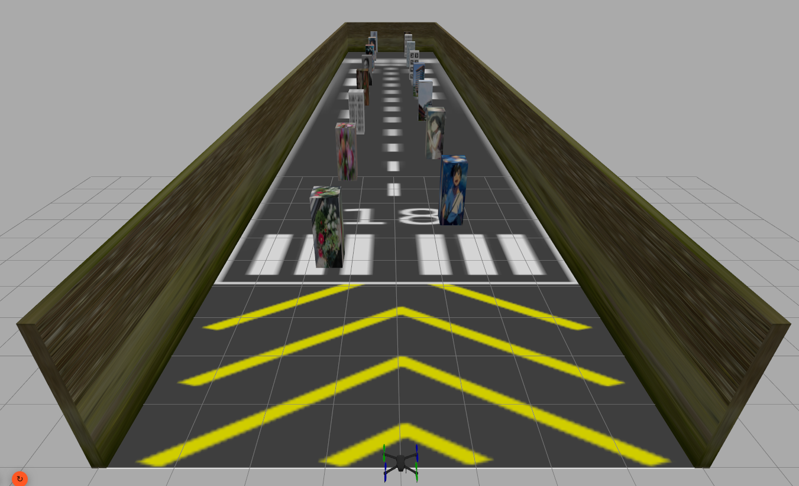
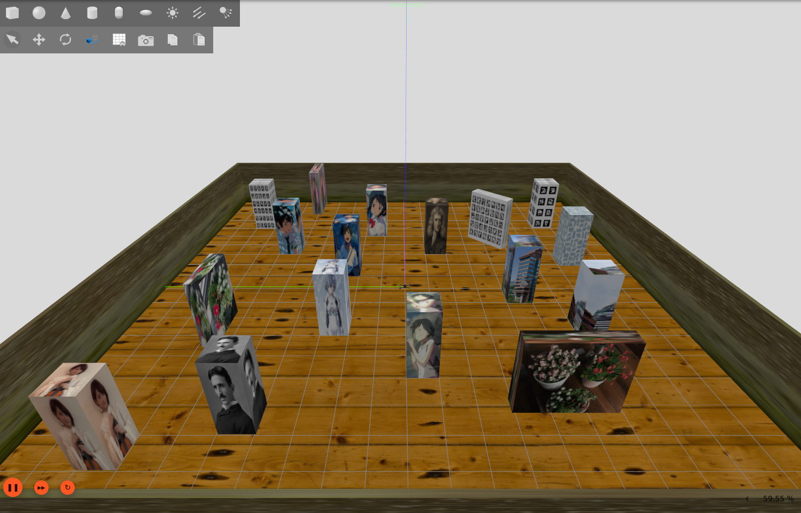
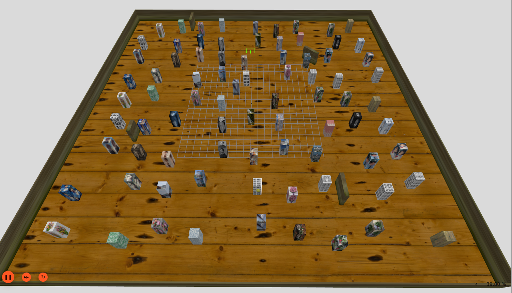
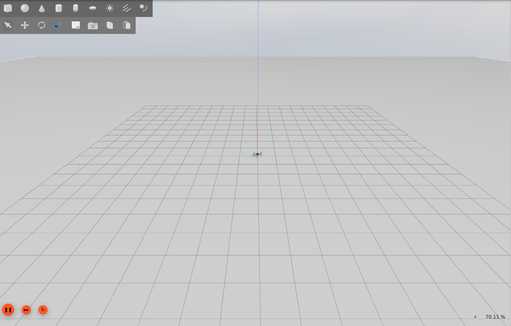

# **Multi UAV SLAM**


> [!NOTE]
> **Collaborative Project:** This repository was developed in collaboration with [@vigyannveshi](https://github.com/vigyannveshi). 
> 
> * **My Primary Contributions:** Setting up the multi-UAV simulation environment (Gazebo Harmonic + Ardupilot SITL), designing the ROS2 and MAVROS communication pipeline, establishing coordinate frame transformations ($tf_2$), and conducting ATE trajectory evaluation benchmarks.
> * **Co-author Contributions:** Integration and implementation of the visual SLAM algorithm (ORB-SLAM3) and trajectory tracking nodes.

### **1. ROS2 Workspace**

|Package|Description|Command|
|---|---|---|
|iris_description| * Description of Iris UAV model.<br> * Description of worlds.<br> * Gazebo plugin to connect with SITL.<br> * ROS2-Gazebo Harmonic Bridging configurations. <br> * Launches single Iris UAV in desired world in Gazebo.| `ros2 launch iris_description gazebo.launch.py`|
|ardupilot_sitl| * Configures SITL to control Iris UAV (default). <br>* Launches Ardupilot SITL + Mavproxy + MAVROS.<br> * Configures SITL to control Iris UAV (GPS-denied, VSLAM) | `ros2 launch ardupilot_sitl sitl.launch.py`<br><br> `ros2 launch ardupilot_sitl sitl.launch.py vslam:=true`|
|iris_control|* Acts as a controller for Iris UAV. <br> * Allows Mission Planning given mission file name as parameter (default file: `mission`).<br> * Allows Iris UAV control with keyboard.|`ros2 run iris_control mission_planner --ros-args -p m:=<mission_name>`<br><br>`ros2 run iris_control keyboard_control`|
|iris_transforms|* Uses `/mavros/local_position/odom` to publish Dynamic TF between `odom <-> base_link` (EKF3 quaternion sign normalized).<br>* Publishes static TF between `base_link <-> camera_left/right` and `camera_left/right_link <-> camera_left/right_optical_link`.<br>* Computes and broadcasts `map -> odom` TF using: `T(map→odom) = T(map→base_link)[SLAM] × T(odom→base_link)[EKF3]⁻¹` (only when `vslam:=true`).<br>* Contains configurations for RViz2.<br>* Launches odom_base_tf_broadcaster, camera_base_tf_broadcaster, map_odom_base_tf_broadcaster and RViz2.|`ros2 run iris_transforms odom_base_tf_broadcaster`<br><br>`ros2 run iris_transforms camera_base_tf_broadcaster`<br><br>`ros2 launch iris_transforms transforms.launch.py`<br><br> `ros2 launch iris_transforms transforms.launch.py vslam:=true`|
|iris_vslam|* Contains configurations for ORB_SLAM3 VSLAM.<br>* `slam_node.cpp` publishes `/orbslam3/pose` (raw ORB-SLAM3 frame) and `/slam/map_points` (3D point cloud) for RViz2 visualization.<br>* `slam_bridge.py` converts `/orbslam3/pose` from ORB-SLAM3 frame → ROS ENU, applies 15° camera tilt correction, publishes to `/mavros/vision_pose/pose` (ArduPilot) and `/slam/path` (RViz2 trajectory). <br>* Launches Visual SLAM by running `slam_node` and `slam_bridge`.|`ros2 launch iris_vslam vslam.launch.py`|
|iris_evaluation|* ATE evaluation for Single UAV SLAM.<br>* `ground_truth_publisher.py` subscribes to Gazebo world pose, filters for `iris` model, publishes `/ground_truth/pose` as ground truth.<br>* `utils/run_ate.py` orchestrates the full ATE pipeline (ground truth publisher → bag recording → mission → evaluation).<br>* `utils/process_ate.py` loads the recorded bag, computes ATE using `evo`, and saves `ate_metrics.txt`, `ate_error.png` and `ate_traj_3d.html` (interactive).<br>* Results saved per-run in `ros2_ws/src/iris_evalution/eval/<mission>_<timestamp>/`.|`ros2 launch iris_evaluation ate.launch.py m:=<mission_name>`|
|<hr>|<hr>**WE ARE HERE**<hr>|<hr>|
|muav_description|* Launches two Iris UAV in desired world in Gazebo.|-|
|muav_control|* Controlling two Iris UAV.|-|
|muav_vslam| * Multi-UAV Visual SLAM |-|
|muav_experiments| * Multiple UAV SLAM experiments|-|

---
---

### **2. Getting Started 🏁**

1. Install all of the following mentioned at [https://github.com/sidharthmohannair/ardupilot-ros2-sitl-setup/tree/main](https://github.com/sidharthmohannair/ardupilot-ros2-sitl-setup/tree/main)

2. Important library installations
   1. `sudo apt install ros-humble-ros-gzharmonic`
   
   * Needed to launch Gazebo-Harmonic using ROS2 launch file since it installs `ros_gz_sim`. 

   * Also needed to spawn Iris UAV using `create` (ROS2 Node) using `ros_gz_sim`. 
   
   * It is a hard and fast rule to use this as it is, i.e. 'gzharmonic', else with ros-humble, apt installs gazebo-ignition 6 and related libraries.
  
   * Testing installation: `ros2 launch ros_gz_sim gz_sim.launch.py`.
     *  Should start Gazebo harmonic simulation environment with empty world.

   2. `sudo apt install ros-humble-ros-gz-bridge`

   * ROS Gazebo-Harmonic Bridge (To bridge topics between Gazebo and ROS2, and vice versa)
   
   3. `sudo apt install ros-humble-tf-transformations`
   
   * Required by `camera_base_tf_broadcaster.py` in `iris_transforms` which uses `tf_transformations` (specifically `quaternion_from_euler`) to compute camera optical frame rotations.
   * Without this, the transforms launch file will fail with `ModuleNotFoundError: No module named 'tf_transformations'`.
   
   4. `pip3 install transforms3d`
   
   * Required backend for `ros-humble-tf-transformations`.

3. Clone the repository using 
    
    `git clone https://github.com/vigyannveshi/MULTI_UAV_SLAM.git`

4. Enter the **ros2_ws** directory
    
    `cd multi_uav_slam/ros2_ws`

5. Create a folder named "logs" in /src/ardupilot_sitl/ardusim

    `mkdir src/ardupilot_sitl/ardusim/logs`

    * This is needed since all the future log files of SITL runs would be registered in the log folder which gets installed on build (hence its presence is needed).

6. Build the workspace

    `colcon build`

    or

    `colcon build --symlink-install` (ensures modifications in files are reflected without rebuild)

7. Launch the Iris UAV in Gazebo (Terminal 1)
   
   `ros2 launch iris_description gazebo.launch.py`
   
   * You can launch different worlds following ([3. Worlds 🗺️](#3-worlds-️)) section.

8. Launch Ardupilot SITL + Mavproxy + MAVROS setup (Terminal 2)
   
   `ros2 launch ardupilot_sitl sitl.launch.py`

9. To start RViz2 Visualization, follow ([5. RViz Visualizations 📈 📊 🧐](#5-rviz-visualizations---))

10.  To run the keyboard control, follow ([6. Keyboard ⌨️ to control Iris (single)](#6-keyboard-️-to-control-iris-single)) section.

11. To run a planned mission, follow ([7. Mission Planning 🏹 🎯 🚩](#7-mission-planning)) section.

12. For Visual SLAM, follow ([9. Single UAV Visual SLAM 🗺️ 👁️](#9-single-uav-visual-slam-️-️)) section.

13. For ATE evaluation, follow ([10. ATE Evaluation 📏](#10-ate-evaluation-)) section.


14. Terminating the simulation.
  
* Terminate the control pipeline, by a KeyboardInterrupt (`ctrl + c`) in their terminal.
* Close Gazebo either through UI by pressing close button or by a KeyboardInterrupt (`ctrl + c`) in its terminal.
* Terminate Ardupilot SITL, and related processes by a KeyboardInterrupt (`ctrl + c`) in their terminal.
* Close the mavproxy-console and terminate mavproxy using `screen -S proxy -X quit`. For further details about step 4, read ([**4. Ardupilot SITL 💻** ](#4-ardupilot-sitl--)).

15. Experiments conducted for Single UAV can be followed at ([11. Experiments 🧪](#11-experiments-)) section.

16. For implementation videos, check out ([Implementation Videos](#-implementation-videos))

---
---


### **3. Worlds 🗺️**

1. Straight Runway with visually enhanced pillars for measurement of **Absolute Trajectory Error (ATE)**, **Relative Pose Error (RPE)**, **Drift per Meter**
   * Single Iris UAV launched on a straight runway world bounded on 3 sides, consisting of pillars to highlight visual features.
  
        `ros2 launch iris_description gazebo.launch.py world:=straight_path_with_pillars`

    

2. Indoor 20x20 world for SLAM **mapping** and **loop closure** experimentation.
   * Contains pillars with visual features.

    `ros2 launch iris_description gazebo.launch.py world:=indoor20x20`

    

3. Indoor 50x50 world for SLAM **mapping** and **loop closure** ATE experimentation.
   * Contains pillars with visual features.
   * We can experiment missions square missions upto 32x32 meters, with good visual features.

    `ros2 launch iris_description gazebo.launch.py world:=indoor50x50`

    

4. Empty World (default, with/without `world` arguement)
   * Lightweight world for testing Iris UAV control.
   
   `ros2 launch iris_description gazebo.launch.py world:=empty`

    

**Note:** The `axes` are disabled in all the worlds, as they act as artifact for camera. Uncomment the code in each world to enable them.

---
---


### **4. Ardupilot SITL 💻** :

`ros2 launch ardupilot_sitl sitl.launch.py` launches the following:

* Ardupilot SITL (ID: 0), which creates an output GCS (primary) at `tcp:127.0.0.1:5760`.
* Mavproxy server which connects to `tcp:127.0.0.1:5760`, and creates two out ports:
  * `udp:127.0.0.1:14550` --> for MAVROS
  * `udp:127.0.0.1:14230` --> additional port.
  * Note: 
    * Mavproxy is run using `screen` and can be accessed using `screen -r proxy` in any terminal.
    * This acts as the primary GCS.
    * It also runs a console for debugging.
* MAVROS which connects to input port `udp:127.0.0.1:14550` and outputs at `udp:127.0.0.1:14555`

**Note:** 
* On termination of terminal wherein the above launch file is launched only ends Ardupilot SITL and MAVROS.

* We need to manually kill Mavproxy and its console which can be done by either of two ways:
  1. run `screen -r proxy`, this opens the running Mavproxy. KeyboardInterrupt it by pressing `ctrl+c`.
  2. Manually close the console, and in any terminal run `screen -S proxy -X quit`

* It is mandatory to kill Mavproxy before re-running the SITL again.

**Parameter Changes**
* `RTL_ALT 400`: 
  * Set to 4m.
  * To stop UAV from climbing in the mission planned for experimental testing when RTL is given.
* `WPNAV_SPEED 100`
  * Set to $1ms^{-1}$
  * To ensure that speed of Iris UAV between two points is not too much. (Just a VSLAM Precaution).
---
---


### **5. Visualization 📈 📊 🧐**

#### **5.1 RViz2 Visualization**

By default, launching the Iris UAV in Gazebo does not create the TF transforms needed by RViz2, since the Iris model is an SDF file with no robot state publisher. The `odom_base_tf_broadcaster` node reads `/mavros/local_position/odom` and publishes the `odom → base_link` TF, giving us the UAV pose relative to its initial takeoff point.

**General mode (without SLAM):**

`ros2 launch iris_transforms transforms.launch.py`

Broadcasts `odom → base_link` and `base_link → camera` TFs. RViz2 opens with the default config showing the TF tree and UAV motion relative to `odom`.

**VSLAM mode:**

`ros2 launch iris_transforms transforms.launch.py vslam:=true rviz2_config:=vslam_config`

RViz2 opens with `vslam_config.rviz` (fixed frame: `map`) showing:

| Topic | Type | Description |
|---|---|---|
| `/slam/path` | Nav Path | SLAM trajectory history (green path) |
| `/slam/map_points` | PointCloud2 | ORB-SLAM3 3D point cloud map |
| TF tree | TF | `map → odom → base_link` |

During flight, `map` and `odom` remain near the origin while `base_link` traces the actual UAV position. The small offset between `map` and `odom` represents the accumulated drift being corrected by SLAM.

---

#### **5.2 Pangolin Visualization**

Pangolin is ORB-SLAM3's built-in 3D viewer, disabled by default (`bUseViewer=false` in `slam_node.cpp`).

To enable, in `iris_vslam/src/slam_node.cpp` change:
```cpp
ORB_SLAM3::System SLAM(argv[1], argv[2], ORB_SLAM3::System::STEREO, false);
```
to:
```cpp
ORB_SLAM3::System SLAM(argv[1], argv[2], ORB_SLAM3::System::STEREO, true);
```
Then rebuild: `colcon build --packages-select iris_vslam`

Pangolin opens automatically when SLAM starts and shows the 3D map with red map points, blue keyframe frustums, green covisibility graph edges, and loop closure edges as a dense fan of lines connecting the return leg keyframes back to early mission keyframes.

---
---


### **6. Keyboard ⌨️ to control Iris (single)**

* Needs the Iris UAV to be launched in Gazebo and Ardupilot SITL along with MAVROS running.

    `ros2 launch iris_description gazebo.launch.py`

    `ros2 launch ardupilot_sitl sitl.launch.py`

* Next wait for the mavproxy console to display `prearm good`. 

* Run the keyboard Control Node
    `ros2 launch iris_control keyboard_control`

* In the terminal of where the node is run, the following keys perform the given control/command 

|Key|Control/Command|Description|
|---|---|---|
|`1`|Takeoff|* Takesoff Iris UAV to 2m. <br> * No key will be functional before and during takeoff.|
|`2`|Land| * Lands the Iris UAV at the current location.<br> * No key will be functional once, LAND command is given, until UAV lands.|
|`w/W`|Throttle Up|* Single press gives small throttle up. <br> * Press and hold, gives continues throttle up.|
|`s/S`|Throttle Down|* Single press gives small throttle down. <br> * Press and hold, gives continues throttle down.|
|`a/A`|Yaw left|* Single press gives small yaw left. <br> * Press and hold, gives continues yaw left.|
|`d/D`|Yaw right|* Single press gives small yaw right. <br> * Press and hold, gives continues yaw right.|
|`/D`|Yaw right|* Single press gives small yaw right. <br> * Press and hold, gives continues yaw right.|
|`⬆️`|Pitch Forward|* Single press gives small pitch forward. <br> * Press and hold, gives continues pitch forward.|
|`⬇️`|Pitch Forward|* Single press gives small pitch forward. <br> * Press and hold, gives continues pitch forward.|
|`⬅️`|Roll Left|* Single press gives small roll left. <br> * Press and hold, gives continues roll left.|
|`➡️`|Roll Right|* Single press gives small roll right. <br> * Press and hold, gives continues roll right.|

**Note:**
* When you throttle down completely such that the UAV touches the ground, you won't be able to move the Iris UAV, hence press `2`, giving a land command to UAV, then press `1`, taking it off again.
* Idea/Params of keyboard control: 
  * With every keypress, a small change (dp) is introduced in the pose which is publised at `/mavros/setpoint_position/local`, inturn simulating the needed motion.
  * Uses publish rate: 45 hz (ROS2 TIMER).
  * h_speed: 2.0 (2D plane X-Y speed, responsible for Roll/Pitch).
  * v_speed: 2.0 (Z-speed, responsible for Throttle).
  * turn_speed: 4.0 (2D angular rotation speed, responsible for Yaw).
  * Observations:
    * The speed and control, is dependent on the `WPNAV_SPEED` (inter-waypoint speed) of the UAV. 
    * Higher the publish rate, better is the control, since when there is no-input the change (dp) is set to 0, which inturn stabilizes the UAV faster after a long-press and release of the key.
    * On the system on which this code is created, these combination works well.

---
---


### **7. Mission Planning 🏹 🎯 🚩** 
* Needs the Iris UAV to be launched in Gazebo and Ardupilot SITL along with MAVROS running.

    `ros2 launch iris_description gazebo.launch.py`

    `ros2 launch ardupilot_sitl sitl.launch.py`

* Next wait for the mavproxy console to display `prearm good`.

* A default mission is provided, which is editable, to edit it:

  * Open a terminal with `ros2_ws` as your present working directory and run
  
    `gedit src/iris_control/config/mission.json`

    or 

    Open `mission.json` in text editor following this path.

  * Structure of mission:

    ```

    {
        "takeoff_height": 2.5,
        "waypoints": [
            [0.0,  0.0, 2.5],
            [6.0,  0.0, 2.5],
            [12.0, 0.0, 2.5],
            [18.0, 0.0, 2.5],
            [24.0, 0.0, 2.5],
            [30.0, 0.0, 2.5],
            [36.0, 0.0, 2.5],
            [30.0, 0.0, 2.5],
            [24.0, 0.0, 2.5],
            [18.0, 0.0, 2.5],
            [12.0, 0.0, 2.5],
            [6.0,  0.0, 2.5],
            [0.0,  0.0, 2.5]
        ],
        "hold_time": [1.0, 0.0, 0.0, 0.0, 0.0, 0.0, 5.0, 0.0, 0.0, 0.0, 0.0, 0.0, 3.0],
        "rtl": "false",
        "land": "true"
    }

    ```

    * This is the default added mission. Running this, the UAV climbs to 2.5m and moves 36m in the x-direction.
    * The above mission is divided into points, since we have a timeout between two waypoints in a mission (i.e. 30s, To edit this check [ros2_ws/src/iris_control/iris_control/utils/base.py](/ros2_ws/src/iris_control/iris_control/utils/base.py)).
    * Ensure all data entry uses floating point numbers, (except RTL).
    * In the `mission.json`, we can specify the following:
      * `takeoff_height`: initial height at which the Iris UAV takes off, for the mission.
      * `waypoints`: list of (floating point lists) containing the [x,y,z] coordinates.
      * `hold_time`: time to hold the UAV at each points. (It is mandatory to add the hold time, if not in use set it to 0.0).
      * `rtl`: Enables return to launch if `true`, disables `rtl` if `false`. Without RTL, the UAV will continue to hover at the last waypoint. RTL is not functional if GPS is denied (VSLAM).  
      * `land`: Enables Iris UAV to land at the last waypoint if `true`.
      * To create a custom mission, create a new JSON file in `src/iris_control/config/` following the same structure (e.g. `mission.json`).

* **Running a custom/named mission:** `ros2 run iris_control mission_planner --ros-args -p m:=<mission_name>` where `<mission_name>` is the JSON filename without extension (e.g. `m:=lcm` runs `lcm.json`). Available missions: `mission` (default straight path), `lcm` (±4m loop closure perimeter), `hlm`, `em`.
---
---

### **8. Sensors for Visual SLAM 🌡️☄ 📷**  

1. Camera 📷
   * We use a stereo camera with a disparity of 6cm.
   * The camera is located at the front of the Iris UAV, and is inclined 15° to capture ground features.
   * Camera parameters (left and right):
     * Horizontal Field of view: 1.3962634
     * Image output: 640x480 (Grayscale)
     * Nearpoint: 10cm
     * Farpoint: 30m
     * update rate: 20hz
   * Transforms for camera: base_link -> camera_left_link -> camera_left_link_optical
                                      -> camera_right_link -> camera_right_link_optical
   * Optical links are to transform the captured image axis to be compatible with image axes conventions used for image processing.
   * The transforms are handled using `camera_base_tf_broadcaster` node in the `iris_transforms` package.
   * To run the node use: `ros2 run iris_transforms camera_base_tf_broadcaster`.
   * Running the transforms launch file, handles it by default, additionally RViz2 is also configured to view the stereo output.
      `ros2 launch iris_transforms transforms.launch.py`

---
---

### **9. Single UAV Visual SLAM 🗺️ 👁️**

> **Prerequisites:** Complete steps 1-6 from [Getting Started 🏁](#2-getting-started-) before proceeding.

> **ORB-SLAM3 dependencies:** Ensure [ORB-SLAM3 Dependencies](docs/orb_slam3_dependencies.md) before proceeding.

> **ORB-SLAM3 installation:** Ensure [ORB-SLAM3 installation](docs/orb_slam3_installation.md) before proceeding.

> **ORB-SLAM3 configurations:** Explains what, how and why each parameter is configured for the ORB-SLAM3 Visual SLAM, see [Configuring ORB-SLAM3 for Iris UAV](docs/configuring_orb_slam3.md) (optional).

---

1. Launch Iris UAV in Gazebo (Terminal 1)

   `ros2 launch iris_description gazebo.launch.py world:=straight_path_with_pillars`

   * Use `world:=indoor20x20` for mapping and loop closure experiments.
   * Use `world:=straight_path_with_pillars` for ATE evaluation.

2. Launch Ardupilot SITL in SLAM mode (Terminal 2)

   `ros2 launch ardupilot_sitl sitl.launch.py vslam:=true`

   * Wait for `AP: AHRS: EKF3 active` and `AP: PreArm: VisOdom: not healthy` in the MAVProxy console before proceeding.
   * `VisOdom: not healthy` is expected at this stage since SLAM is not running yet.

3. Ensure Transforms, and run RViz2 to visualize
  
    `ros2 launch iris_transforms transforms.launch.py vslam:=true rviz2_config:=vslam_config`

4. Start VSLAM (Terminal 4)

    `ros2 launch iris_vslam vslam.launch.py`

    To capture the full SLAM log for debugging, run instead:

    `ros2 launch iris_vslam vslam.launch.py 2>&1 | tee slam_output.txt`

5. The Iris UAV can be controlled in the following way:
   * Keyboard control: check ([6. Keyboard ⌨️ to control Iris (single)](#6-keyboard-️-to-control-iris-single)) section.
   * Mission Planning: check ([7. Mission Planning 🏹 🎯 🚩](#7-mission-planning---)) section.  

6. For termination:
   * Close the Visual SLAM by terminating via keyboard interrupt.
   * Follow (step 14.) from [Getting Started 🏁](#2-getting-started-).
---

**📄 Related Documentation**
| Doc | Description |
|---|---|
| [EKF3 Vision Configuration](docs/ekf3_vision_config.md) | ArduPilot parameter changes for GPS-denied visual odometry using EKF3 |
| [Selecting VSLAM Algorithm](docs/vslam_algorithm.md) | Why ORB-SLAM3 was chosen and why the zang09 ROS2 wrapper was selected |
| [ORB-SLAM3 Dependencies](docs/orb_slam3_dependencies.md) | Installation and verification of OpenCV, Eigen3, and Pangolin required for ORB-SLAM3 |
| [ORB-SLAM3 Installation](docs/orb_slam3_installation.md) | Steps to build ORB-SLAM3 core and ROS2 wrapper, including all fixes for Ubuntu 22.04 + Humble |
| [Configuring ORB-SLAM3 for Iris UAV](docs/configuring_orb_slam3.md)| Explains what, how and why each parameter is configured for the ORB-SLAM3 Visual SLAM |
| [Loop Closure Testing](docs/loop_closure.md) | Experimental investigation of ORB-SLAM3 loop closure modifications — source changes tried, ATE comparison, and why the original pipeline was retained |
| [Gazebo Vocabulary Training](docs/gazebo_vocabulary.md) | Step-by-step guide to training a custom DBoW2 vocabulary for ORB-SLAM3 from simulation images, with guidance on when to use custom vs default vocabulary |


---
---

### **10. ATE Evaluation 📏**

> **Setup:** See [ATE Evaluation](docs/ate_eval.md) for evo installation, virtual environment setup, and path configuration.
> **Prerequisites:** Complete [Section 9 (Single UAV Visual SLAM)](#9-single-uav-visual-slam-️-️) before proceeding.

---

1. Complete steps 1–4 from [Section 9](#9-single-uav-visual-slam-️-️) and wait for `pre-arm good` in mavproxy console before proceeding.

2. Run the automated ATE pipeline (Terminal 5):

   `ros2 launch iris_evaluation ate.launch.py m:=<mission_name>`

   This starts the ground truth publisher, bag recording, and mission automatically. Results are saved to `ros2_ws/src/iris_evaluation/eval/<mission_name>_<timestamp>/` on mission completion.

---

**📄 Related Documentation**
| Doc | Description |
|---|---|
| [ATE Evaluation](docs/ate_eval.md) | evo installation, path configuration, manual ATE approach, result interpretation |

---
---

### **11. Experiments 🧪**

Single-UAV VSLAM experiments covering loop closure pipeline investigation and ATE evaluation across different flight heights and loop sizes. See **[Experiments](docs/experiments.md)** for full results and analysis.

---
---

### **#. Implementation Videos**

These videos demonstrate the system working end-to-end and are intended for anyone who wants to see the implementation in action before setting it up.

| Video | Description |
|---|---|
| [ATE Evaluation - straight_path_with_pillars](https://drive.google.com/file/d/1kPhcpPnLMhDs35YpPGSaIfELk6N_QWD6/view?usp=sharing) | ATE evaluation run on the straight path with pillars world |
| [Loop Closure - indoor20x20 (16×16, 3m)](https://drive.google.com/file/d/1U2eQSZO6VoZQCznOGHT789gQqM-2LKi9/view?usp=sharing) | Loop closure firing on a 16×16m loop at 3m height with ATE evaluation in indoor20x20 world |
| [indoor50x50 exploration & Keyboard Control in VSLAM Mode](https://drive.google.com/file/d/1gmg0P_9UU95FJi77i9ziZ6sdzT2cwC0W/view?usp=sharing) | Exploring the indoor50x50 world with keyboard control while VSLAM is running |

---
---

###  **#. File Organization 📁**

For a complete annotated file tree of the workspace, ORB-SLAM3 installation, and all supporting tools, see:

**[Repository & Workspace Structure](docs/repo_ws_structure.md)**

---
---
### **#. Key Issues ⚠️**

1. Time synchronization error between MAVROS, Ardupilot, Gazebo

    ```
    [mavros_node-3] [WARN] [1774378506.389352614] [mavros.time]: TM: RTT too high for timesync: 899.76 ms.
    [mavros_node-3] [ERROR] [1774378567.091747912] [mavros.time]: TM: Time jump detected. Resetting time synchroniser.
    ```

    Problems:
    * After 5 minutes or so, MAVROS auto-shuts down although `respawn = True`.
    * Additionally the ROS2 Gazebo bridge, stops functioning, so topics mapped from Gazebo to ROS2 stop working.
  
    Solutions Attempted (which don't solve the problem):
    * Tried direct (Ardupilot SITL --> MAVROS) removing the Mavproxy in between.
    * Added use_sim_time = 'true' launch parameter running mavros launch file. 
      * Observed, that the malfunctioning happens faster.
    * Referred solutions on [Ardupilot official documentation](https://ardupilot.org/dev/docs/ros-timesync.html)
      * `SCHED_LOOP_RATE 500` (STILL USING), `BRD_RTC_TYPES 2` set in `gazebo-iris.parm` 
    * Tried searching online, most of them describe the same problem in PX4 + MAVROS + Gazebo, where we can pass Gazebo clock to `PX4`, was my understanding to their solution, but this is not possible in Ardupilot.
    
    Status: `PARTIALLY SOLVED`
    * Reason for the error (my understanding and observations): `time_unix_usec` was 0 for Ardupilot SITL, but `time_boot_ms` was increasing. Net time = `time_unix_usec + time_boot_ms` didn't synchronize with the time mavros was using for synchronization.
    * The following changes were made.
      1. Mavros is ran using Node inplace of existing launch file in `sitl.launch.py`.
      2. To get this done, a config folder is created and two files namely `apm_config.yaml` and `apm_pluginlists.yaml` are copied from (/opt/ros/humble/share/mavros/launch) and changes were made to `apm_config.yaml`.
          ```
            # sys_time
            /**/time:
              ros__parameters:
                time_ref_source: "fcu"    # time_reference source
                timesync_mode: NONE
                timesync_avg_alpha: 0.6   # timesync averaging factor
                timesync_rate: 0.0       # TIMESYNC rate in Hertz (feature disabled if 0.0)
                system_time_rate: 1.0     # send system time to FCU rate in Hertz (disabled if 0.0)
          ```
      3. Addtionally two additional parameters were passed while running SITL, `--synthetic-clock`, `"--start-time", str(int(time.time()))`. I experimented on disabling both of this params, still there were no synchronization issues.
      4. `BRD_RTC_TYPES 2` --> must be removed from `gazebo-iris.parm`.
      5. `SCHED_LOOP_RATE 400` --> is removed from `gazebo-iris.parm`.
   * Issue still remaining: All ROS2 topics after a long while stop publishing. No MAVROS topics, no `ros_gz_bridge` topics, although Gazebo topics are still present. Nodes appear to be zombieing rather than cleanly shutting down. Root cause suspected to be Gazebo sim-time vs wall-clock drift causing `ros_gz_bridge` timeouts. Since most SLAM experiments complete within 5-6 minutes, this is currently acceptable.

  Note: `map` and `map_ned` frames show "No transform" warning in RViz2 — this is expected and harmless. These frames are only connected by MAVROS when the UAV is armed with a valid EKF solution. They are not required for Visual SLAM.

---
---

### **#. System Used**

* Hardware:
  * CPU: Ryzen 7 5700U
  * RAM: 16GB
  * (without GPU)
* Software:
  * Python: 3.10.12
  * Ubuntu: 22.04
  * ROS2 Humble
  * Gazebo Harmonic: 8.11.0
  * ArduPilot: 4.6.0-beta1-5292-gd56f48390b