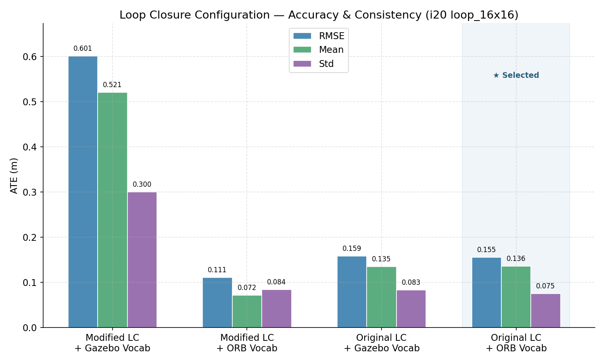
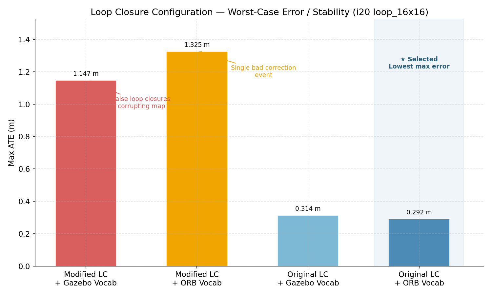
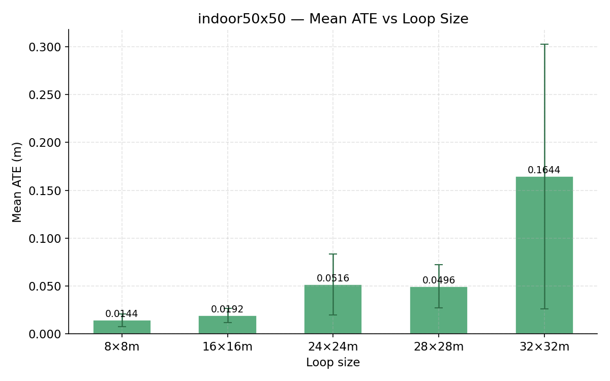
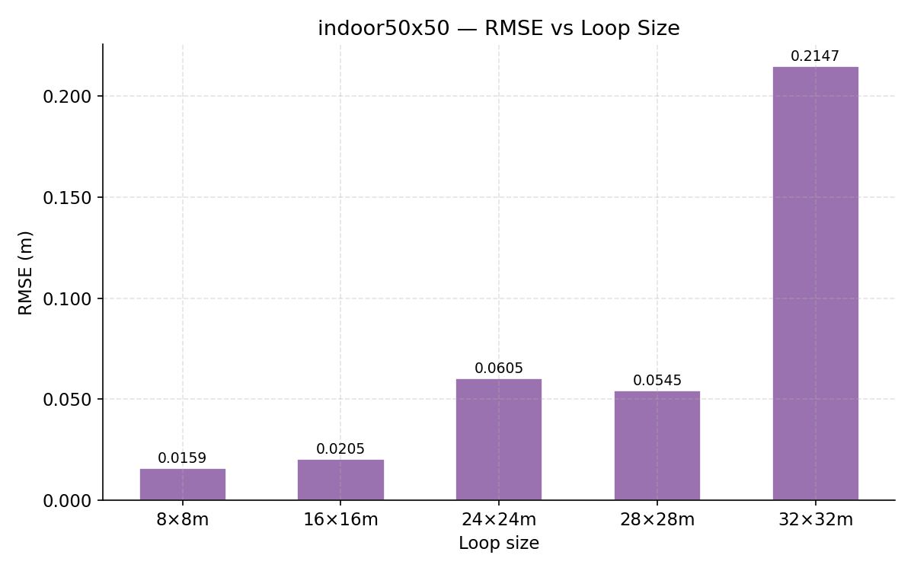
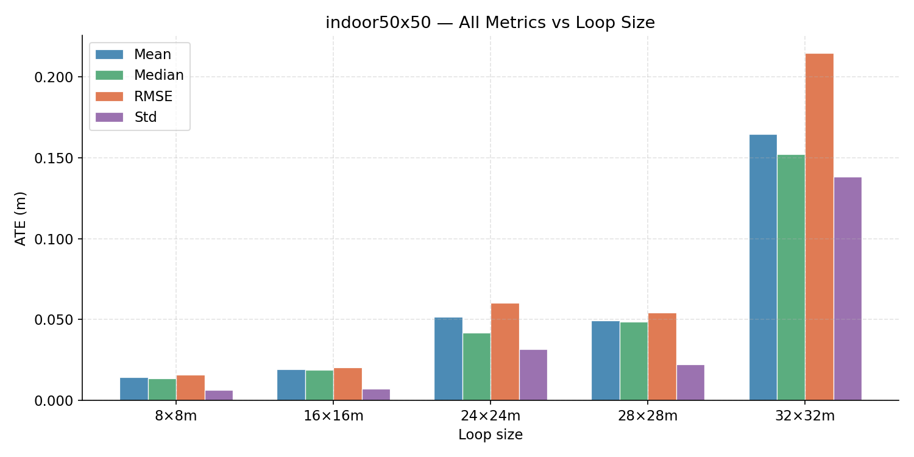
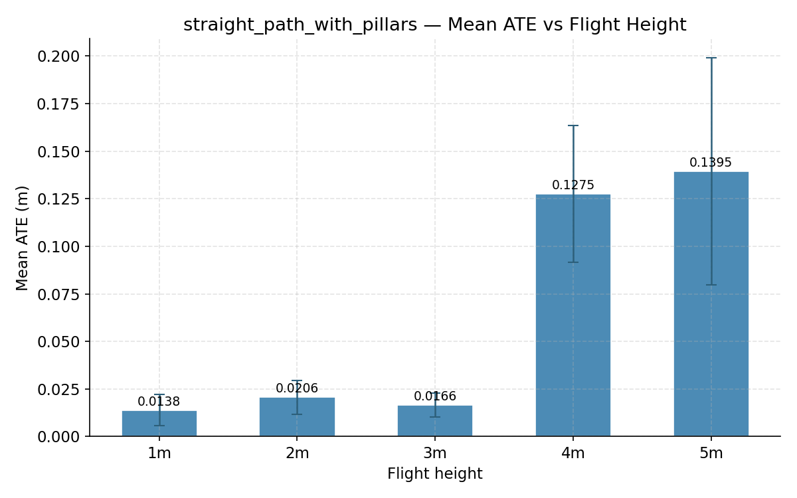
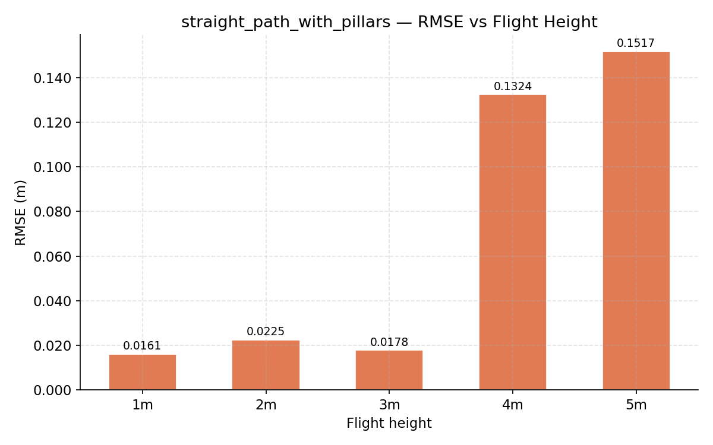
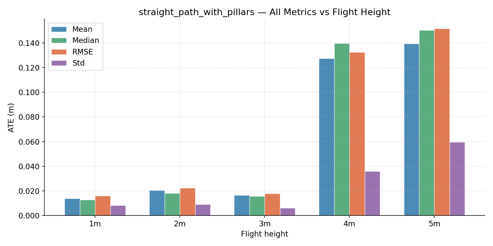

**[⬅️ Back to README](../README.md)**

## **Experiments**

This document presents the experiments conducted during the single-UAV Visual SLAM evaluation phase. The ATE evaluation pipeline is described in [ate_eval.md](ate_eval.md).

---

### **Experiment 1: Loop Closure Pipeline Investigation**

An investigation into improving loop closure reliability in Gazebo simulation environments. Two approaches were tried: retraining the DBoW2 vocabulary on Gazebo images, and adding a spatial fallback to `LoopClosing.cc` to bypass Sim3 RANSAC when it fails.

A controlled 4-configuration ATE comparison on `i20_loop_16x16` showed the original unmodified pipeline with `ORBvoc.txt` produces the most stable results. The modifications were reverted.

**Plots:**

**Summary:**

| Configuration | RMSE | Mean | Max |
|---|---|---|---|
| Modified LC + Gazebo Vocab | 0.601 m | 0.521 m | 1.147 m |
| Modified LC + ORB Vocab | 0.111 m | 0.072 m | 1.326 m |
| Original LC + Gazebo Vocab | 0.159 m | 0.135 m | 0.314 m |
| **Original LC + ORB Vocab** ✓ | **0.155 m** | **0.136 m** | **0.292 m** |

For full details of all source changes tried and why they were reverted, see [loop_closure.md](loop_closure.md) and [gazebo_vocabulary.md](gazebo_vocabulary.md).

---

### **Experiment 2: ATE Analysis**

ATE was evaluated using the automated pipeline (`ate.launch.py`). Ground truth is the Gazebo world pose of the `iris` model published by `ground_truth_publisher`. SLAM output is `/mavros/vision_pose/pose`. Alignment uses Umeyama SE(3).

All runs use: original ORB-SLAM3 pipeline, `ORBvoc.txt`, stereo mode.

---

#### **2.1 indoor50x50: Loop Size Sweep**

**World:** `indoor50x50` (50×50m, 81 pillars on 5m grid)
**Variable:** Loop size (square perimeter)
**Fixed:** Flight height 3.0m

Loop closure was observed only for the 32×32m loop. All smaller loops completed without loop closure firing.

**Plots:**

**Results:**

| Loop size | RMSE | Mean | Median | Std | Max | Loop closure |
|---|---|---|---|---|---|---|
| 8×8m | 0.0159 m | 0.0144 m | 0.0135 m | 0.0067 m | 0.0393 m | ✗ |
| 16×16m | 0.0205 m | 0.0192 m | 0.0190 m | 0.0074 m | 0.0538 m | ✗ |
| 24×24m | 0.0605 m | 0.0516 m | 0.0420 m | 0.0316 m | 0.2055 m | ✗ |
| 28×28m | 0.0545 m | 0.0496 m | 0.0485 m | 0.0225 m | 0.1341 m | ✗ |
| 32×32m | 0.2147 m | 0.1644 m | 0.1522 m | 0.1382 m | 0.8183 m | ✓ |

**Interactive trajectory plots** (open locally in browser):
- [8×8m trajectory](../images/results/experiment_2/i50_loop_8x8_ate_traj_3d.html)
- [16×16m trajectory](../images/results/experiment_2/i50_loop_16x16_ate_traj_3d.html)
- [24×24m trajectory](../images/results/experiment_2/i50_loop_24x24_ate_traj_3d.html)
- [28×28m trajectory](../images/results/experiment_2/i50_loop_28x28_ate_traj_3d.html)
- [32×32m trajectory](../images/results/experiment_2/i50_loop_32x32_ate_traj_3d.html)

**Key observations:**

- 8×8 and 16×16 achieve very low ATE (~0.016–0.021m RMSE) without any loop closure — the loops are small enough that raw tracking drift over the perimeter remains negligible.
- 24×24 and 28×28 show increased drift (~0.055–0.061m RMSE) with no loop closure correction. 28×28 is slightly better than 24×24 (lower std: 0.023m vs 0.032m), likely because the longer perimeter allows better map maturation before returning to the start.
- 32×32 has the worst ATE (0.215m RMSE, max 0.818m) despite loop closure firing — significant drift had accumulated before correction, and the correction itself introduced a large instantaneous jump visible in the max error.

---

#### **2.2 straight_path_with_pillars: Height Sweep**

**World:** `straight_path_with_pillars` (40m corridor, pillars at y=±1.5m, 1.75m tall, walls 2.5m tall)
**Variable:** Flight height (1m–5m)
**Mission:** Fly straight from x=0 to x=36m and land

No loop closure was tested in this experiment. The mission is a straight one-way path to measure raw SLAM drift at different heights.

**Plots:**

**Results:**

| Height | RMSE | Mean | Median | Std | Max |
|---|---|---|---|---|---|
| 1m | 0.0161 m | 0.0138 m | 0.0128 m | 0.0082 m | 0.0515 m |
| 2m | 0.0225 m | 0.0206 m | 0.0182 m | 0.0090 m | 0.0487 m |
| **3m** ✓ | **0.0178 m** | **0.0166 m** | **0.0157 m** | **0.0063 m** | **0.0392 m** |
| 4m | 0.1324 m | 0.1275 m | 0.1396 m | 0.0360 m | 0.1847 m |
| 5m | 0.1517 m | 0.1395 m | 0.1502 m | 0.0597 m | 0.2850 m |

**Interactive trajectory plots** (open locally in browser):
- [1m trajectory](../images/results/experiment_2/sp_h1_ate_traj_3d.html)
- [2m trajectory](../images/results/experiment_2/sp_h2_ate_traj_3d.html)
- [3m trajectory](../images/results/experiment_2/sp_h3_ate_traj_3d.html)
- [4m trajectory](../images/results/experiment_2/sp_h4_ate_traj_3d.html)
- [5m trajectory](../images/results/experiment_2/sp_h5_ate_traj_3d.html)

**Key observations:**

- 1m, 2m, and 3m all perform well (RMSE 0.016–0.023m) with 3m being the best overall including the lowest max error (0.039m) and lowest std (0.006m).
- There is a sharp degradation threshold between 3m and 4m — RMSE jumps from 0.018m to 0.132m. This corresponds to the UAV rising above the pillar height (1.75m) and approaching the wall height (2.5m), reducing the dominant vertical features visible to the camera.
- At 5m the UAV exceeds the wall height entirely. RMSE increases to 0.152m with higher std (0.060m) indicating intermittent tracking instability.
- **Recommended flight height: 3m**, best ATE, lowest std, lowest max error, and within the reliable feature zone.
